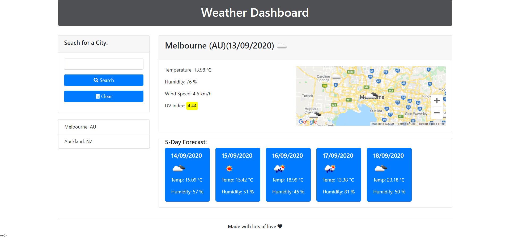

# Weather Dashboard

* [Description](#Description)
* [Usage](#Usage)
* [Technologies Utilized](#Technologies-Utilized)
* [Weather Dashboard](#Weather-Dashboard)
* [Contact](#Contact)
* [License](#License)

## Description
This website provides access to current and future weather conditions.

## Usage
GIVEN a weather dashboard with form inputs
* Search by city to view the current and future conditions
    *  City is added to the search history
* View the city name, the date, an icon representation of weather conditions, the temperature, the humidity, the wind speed, and the UV index
* The UV index color codes indicates whether the conditions are favorable, moderate, or severe
* View a 5-day forecast including the date, an icon representation of weather conditions, the temperature, and the humidity
* Search by city history
* The last searched city forecast will display when the browser is closed and reopened.

The following image demonstrates the application functionality:

 

## Technologies Utilized
Primary technologies:
* Web API's (OpenWeather API)
* Moment.js
* jQuery
* Javascript
* Bootstrap 4.5.2
* HTML-5
* CSS-3

## Weather Dashboard

* Please find Weather Dashboard page here: <a href="https://chrisjmckeown.github.io/Weather_Dashboard/" target="_blank">Weather Dashboard</a>

## Contact

* Please contact me at: chris.j.mckeown@hotmail.com

## License

* See license here: <a href="https://github.com/chrisjmckeown/Weather_Dashboard/blob/master/LICENSE" target="_blank">license agreement</a>